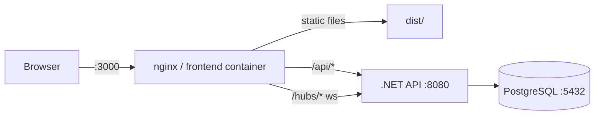
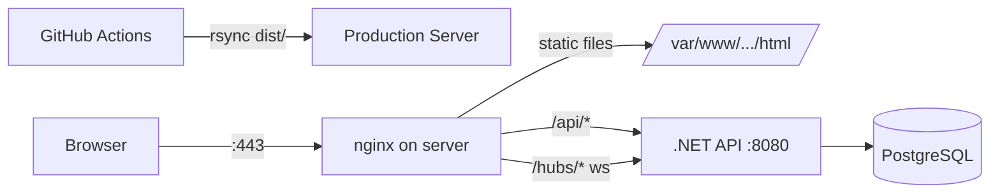

# Deployment Guide

## Prerequisites

| Tool           | Version | Install                                      |
|----------------|---------|----------------------------------------------|
| Node.js        | 22+     | https://nodejs.org                           |
| pnpm           | 9+      | `corepack enable && corepack prepare pnpm@latest --activate` |
| Docker         | 24+     | https://docs.docker.com/get-docker           |
| docker-compose | v2+     | Bundled with Docker Desktop                  |

---

## Local Development (without Docker)

### 1. Start the backend and database

The .NET API and PostgreSQL run via Docker Compose while the frontend runs natively:

```bash
docker compose up db server
```

This starts:
- **PostgreSQL 16** — port 5432 (internal only, no host mapping)
- **.NET API** — `http://localhost:8080`

The API auto-applies EF Core migrations on startup and exposes:
- REST endpoints under `/api/`
- SignalR hub at `/hubs/wheel`
- Health check at `/health`
- Swagger UI at `/swagger` (development mode only)

### 2. Start the frontend

```bash
pnpm install
pnpm dev
```

Vite dev server starts at **`http://localhost:3000`** with proxy rules that forward:
- `/api/*` → `http://localhost:8080`
- `/hubs/*` → `http://localhost:8080` (including WebSocket upgrade)

The frontend reads `VITE_HISTORY_API_URL` at build time. In dev mode this variable is unset, so `wheelHubApi.ts` falls back to `http://localhost:8080` for the SignalR connection. The Vite proxy handles REST and WebSocket traffic transparently.

### Port summary (local dev)

| Service    | URL                        |
|------------|----------------------------|
| Frontend   | http://localhost:3000       |
| API        | http://localhost:8080       |
| SignalR    | ws://localhost:8080/hubs/wheel |
| PostgreSQL | db:5432 (Docker-internal, not exposed to host) |

---

## Full Docker Stack

Recommended for testing the production-like setup locally.

### Start everything

```bash
docker compose up --build
```

### Services

| Service    | Image / Build          | Internal Port | Host Port |
|------------|------------------------|---------------|-----------|
| `db`       | `postgres:16-alpine`   | 5432          | —         |
| `server`   | `./server/Dockerfile`  | 8080          | 8080      |
| `frontend` | `./Dockerfile` (nginx) | 80            | 3000      |

Open `http://localhost:3000` to access the app.

### How it works

```
Browser :3000 → nginx (frontend container)
                  ├── static files    → /usr/share/nginx/html
                  ├── /api/*          → proxy_pass http://server:8080
                  └── /hubs/*         → proxy_pass http://server:8080  (WebSocket upgrade)

server :8080 → .NET 9 API → PostgreSQL (db:5432)
```

Nginx handles:
- SPA fallback (`try_files $uri $uri/ /index.html`)
- Gzip compression
- Aggressive caching for hashed `/assets/*` files (1 year, immutable)
- WebSocket upgrade headers for SignalR (`Connection: upgrade`)

### Rebuild a single service

```bash
docker compose up --build server    # rebuild only the API
docker compose up --build frontend  # rebuild only the frontend
```

### Reset the database

```bash
docker compose down -v   # removes the pgdata volume
docker compose up --build
```

---

## Production Deployment (CI/CD)

Production deploys only the **frontend** (static files) via CI. The backend is deployed separately.

### GitHub Actions — Production

**Workflow:** `.github/workflows/deploy-production.yml`
**Trigger:** Push to `main`

Steps:
1. Checkout → install pnpm + Node 22 → `pnpm install --frozen-lockfile`
2. Build SSG with `VITE_DONATEX_CLIENT_ID` and `VITE_HISTORY_API_URL` from secrets
3. Generate source-hashes manifest and create a GitHub Release (`deploy-<short-sha>`)
4. Build VitePress docs (`pnpm docs:build`)
5. rsync `dist/` → server at `/var/www/pointauc.com/html/`
6. rsync `docs/.vitepress/dist/` → `/var/www/pointauc.com/html/docs/`

### GitHub Actions — Staging

**Workflow:** `.github/workflows/deploy-staging.yml`
**Trigger:** Manual (`workflow_dispatch`), optionally specifying a branch

Same build process, deploys to:
- App: `/var/www/test.pointauc.com/html/`
- Docs: `/var/www/test.pointauc.com/html/docs/`

### Required GitHub Secrets

| Secret                              | Description                          |
|-------------------------------------|--------------------------------------|
| `SSH_PRIVATE_KEY`                   | SSH key for rsync to the server      |
| `SSH_HOST`                          | Production server hostname/IP        |
| `SSH_PORT`                          | SSH port                             |
| `SSH_USER`                          | SSH username                         |
| `VITE_HISTORY_API_URL_PRODUCTION`   | Backend API URL for production build |
| `VITE_HISTORY_API_URL_STAGING`      | Backend API URL for staging build    |
| `VITE_DONATEX_CLIENT_ID_PRODUCTION` | Donatex OAuth client ID (production) |
| `VITE_DONATEX_CLIENT_ID_STAGING`    | Donatex OAuth client ID (staging)    |

### Server-side nginx (production)

The CI rsync's pre-built static files to the server. You need nginx on the server configured to:

1. Serve static files from `/var/www/pointauc.com/html/`
2. Proxy `/api/*` and `/hubs/*` to the .NET API (same logic as `nginx/nginx.conf`)
3. Enable WebSocket upgrade for `/hubs/*`
4. Enable gzip and SPA fallback

Example server-side config (adapt from `nginx/nginx.conf`):

```nginx
server {
    listen 443 ssl;
    server_name pointauc.com;

    root /var/www/pointauc.com/html;
    index index.html;

    # SSL config (managed by certbot or similar)
    # ...

    location /api/ {
        proxy_pass http://127.0.0.1:8080;
        proxy_set_header Host $host;
        proxy_set_header X-Real-IP $remote_addr;
        proxy_set_header X-Forwarded-For $proxy_add_x_forwarded_for;
        proxy_set_header X-Forwarded-Proto $scheme;
    }

    location /hubs/ {
        proxy_pass http://127.0.0.1:8080;
        proxy_http_version 1.1;
        proxy_set_header Upgrade $http_upgrade;
        proxy_set_header Connection "upgrade";
        proxy_set_header Host $host;
        proxy_set_header X-Real-IP $remote_addr;
        proxy_set_header X-Forwarded-For $proxy_add_x_forwarded_for;
        proxy_set_header X-Forwarded-Proto $scheme;
    }

    location ~* /assets/ {
        expires 1y;
        add_header Cache-Control "public, immutable";
    }

    location / {
        try_files $uri $uri/ /index.html;
    }
}
```

### Backend deployment (manual)

The .NET API is not currently deployed via CI. To deploy or update it on the server:

```bash
# On the server, or via SSH
cd /path/to/server
git pull origin main

# Option A: Docker
docker build -t vertuta-server .
docker run -d --restart unless-stopped \
  -p 8080:8080 \
  -e "ConnectionStrings__DefaultConnection=Host=localhost;Port=5432;Database=vertuta;Username=vertuta;Password=<PASSWORD>" \
  -e "AllowedOrigins__0=https://pointauc.com" \
  vertuta-server

# Option B: Direct dotnet
dotnet publish -c Release -o /opt/vertuta-server
# Then restart the systemd service or equivalent
```

Ensure `AllowedOrigins__0` matches the production domain for CORS.

---

## Environment Variables Reference

### Frontend (Vite build-time)

These are baked into the static bundle at build time via `import.meta.env`.

| Variable                | Required | Default                  | Description                                                      |
|-------------------------|----------|--------------------------|------------------------------------------------------------------|
| `VITE_HISTORY_API_URL`  | No       | `http://localhost:8080`  | Backend API base URL. Empty string = relative URLs (nginx proxy) |
| `VITE_DONATEX_CLIENT_ID`| No       | —                        | Donatex OAuth client ID                                          |

When `VITE_HISTORY_API_URL` is empty (as in the Docker build), the frontend uses relative paths (`/api/`, `/hubs/`), relying on nginx to proxy to the backend.

### Server (.NET)

| Variable                                | Default                                           | Description              |
|-----------------------------------------|---------------------------------------------------|--------------------------|
| `ConnectionStrings__DefaultConnection`  | `Host=localhost;Port=5432;Database=vertuta;...`   | PostgreSQL connection    |
| `AllowedOrigins__0`                     | `http://localhost:3000`                           | CORS allowed origin (first) |
| `AllowedOrigins__1`                     | `http://localhost:5173`                           | CORS allowed origin (second) |
| `ASPNETCORE_ENVIRONMENT`               | `Production`                                      | Enables Swagger in `Development` |

### Docker Compose

| Variable            | Default   | Description                |
|---------------------|-----------|----------------------------|
| `POSTGRES_DB`       | `vertuta` | PostgreSQL database name   |
| `POSTGRES_USER`     | `vertuta` | PostgreSQL username        |
| `POSTGRES_PASSWORD` | `vertuta` | PostgreSQL password        |

---

## Architecture Diagram

### Docker Compose Mode



### Production CI/CD Mode



---

## Troubleshooting

### CORS errors

**Symptom:** Browser console shows `Access-Control-Allow-Origin` errors.

**Fix:** Ensure the .NET API has the correct origin in `AllowedOrigins`:
```bash
# Docker Compose
AllowedOrigins__0=http://localhost:3000

# Production
AllowedOrigins__0=https://pointauc.com
```

The origin must match exactly (protocol + host + port). SignalR requires `.AllowCredentials()`, which means wildcard (`*`) origins are not supported.

### WebSocket connection fails

**Symptom:** SignalR falls back to long-polling or fails entirely.

**Causes & fixes:**
1. **nginx not upgrading WebSocket** — ensure the `/hubs/` location block includes:
   ```nginx
   proxy_http_version 1.1;
   proxy_set_header Upgrade $http_upgrade;
   proxy_set_header Connection "upgrade";
   ```
2. **Wrong `VITE_HISTORY_API_URL`** — if set to an absolute URL, the browser connects directly to the API, bypassing nginx. Set it to empty string for proxied setups.
3. **Firewall blocking port 8080** — in Docker mode, the `server` container exposes 8080 on the host. In production, only nginx should reach the API.

### Build fails with SSG errors

**Symptom:** `pnpm build:ssg` fails during prerender.

**Fix:** SSG prerender runs your React app in Node. Common issues:
- Browser-only APIs (window, document) used at module level — guard with `typeof window !== 'undefined'`
- Missing environment variables — ensure `VITE_HISTORY_API_URL` is set (even as empty string)

### Database connection refused

**Symptom:** API logs `Npgsql.NpgsqlException: Connection refused`.

**Fix:**
- In Docker Compose, the `server` service uses `Host=db` (the Docker service name). Ensure `db` is healthy before `server` starts (the compose file has `depends_on` with healthcheck).
- Locally, ensure PostgreSQL is running on port 5432 or adjust the connection string.

### Container rebuilds not picking up changes

**Fix:** Always use `--build` flag:
```bash
docker compose up --build
```

To force a clean rebuild without cache:
```bash
docker compose build --no-cache
docker compose up
```

### Port conflicts

If port 3000 or 8080 is already in use:
```bash
# Check what's using the port (Linux/macOS)
lsof -i :3000

# Or change ports in docker-compose.yml
ports:
  - "3001:80"   # frontend on 3001 instead of 3000
```
